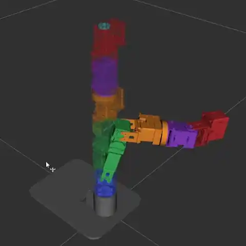
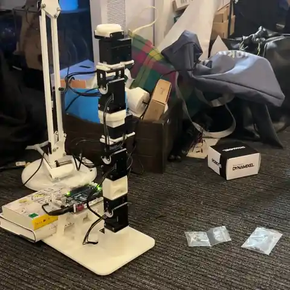

# Robot Arm

自作ロボットアームのCAD/URDF生成、MoveIt設定、OpenCR + DYNAMIXEL実機制御をまとめたワークスペースです。

現在は、Fusion 360から出力したメッシュとCSVをもとにURDFを生成し、ROS 2 Jazzy + MoveItで軌道計画し、OpenCRへ `FollowJointTrajectory` を送って実機を動かすところまで進めています。

## Demo

### RViz / MoveIt

[](docs/media/rviz-demo.mp4)

### Real Robot

[](docs/media/real-robot-demo.mp4)

## Repository Layout

```text
arm_ws/src/
  robot_arm_description/     ROS 2 description package with URDF and meshes
  robot_arm_moveit_config/   MoveIt configuration package
  robot_arm_opencr_bridge/   FollowJointTrajectory -> OpenCR serial bridge

cad/
  exports/                   Fusion 360 mesh/table exports
  fusion/                    Fusion archive/extracted files

urdf/                        Generated and simplified URDF models
tools/                       URDF generation, PyBullet checks, IK/FK utilities
sketches/opencr_dxl_check/   OpenCR firmware for DYNAMIXEL control
docs/                        Setup notes and development logs
```

## Current Hardware Mapping

OpenCRの `q` コマンドは次のID順で角度を受け取ります。

```text
ID1 base_yaw_joint
ID2 shoulder_pitch_joint
ID3 upper_arm_roll_joint
ID4 elbow_pitch_joint
ID5 elbow_roll_joint
ID6 wrist_pitch_joint
```

実機ブリッジの現在の符号は全軸 `+1.0` です。

## Build MoveIt Workspace

Ubuntu 24.04 + ROS 2 Jazzyを想定しています。

```sh
cd ~/arm_ws
source /opt/ros/jazzy/setup.bash
colcon build
source install/setup.bash
```

このリポジトリから復元する場合は、`arm_ws/src` の中身を `~/arm_ws/src` に置いてからビルドします。

## Run In Simulation / RViz

```sh
cd ~/arm_ws
source /opt/ros/jazzy/setup.bash
source install/setup.bash

ros2 launch robot_arm_moveit_config demo.launch.py
```

RVizのMotionPlanningパネルでPlanning Group `arm` を選び、まずは小さい関節角の動きから確認します。

## Run With Real Robot

OpenCRが見えているポートを確認します。

```sh
ls /dev/ttyACM* /dev/ttyUSB* 2>/dev/null
```

実機送信前はdry-runで `q ...` の角度列を確認します。

```sh
cd ~/arm_ws
source /opt/ros/jazzy/setup.bash
source install/setup.bash

ros2 launch robot_arm_opencr_bridge opencr_moveit.launch.py \
  execute:=false \
  port:=/dev/ttyACM1 \
  max_step_deg:=5.0
```

実機へ送信する場合:

```sh
ros2 launch robot_arm_opencr_bridge opencr_moveit.launch.py \
  execute:=true \
  port:=/dev/ttyACM1 \
  max_step_deg:=5.0
```

最初は `random valid` を使わず、1軸だけ数度動かす小さい目標から確認してください。

## OpenCR Firmware

OpenCR用ファームウェア:

```text
sketches/opencr_dxl_check/opencr_dxl_check.ino
```

ビルドとアップロード:

```sh
make build
make upload PORT=/dev/ttyACM1
```

アップロード後に `/dev/ttyACM0` と `/dev/ttyACM1` が入れ替わることがあります。

## Notes

詳細な作業ログとトラブルシュートは以下にあります。

```text
docs/moveit_sim_start.md
docs/robot_arm_control_startup.md
docs/ubuntu_development_setup.md
```
